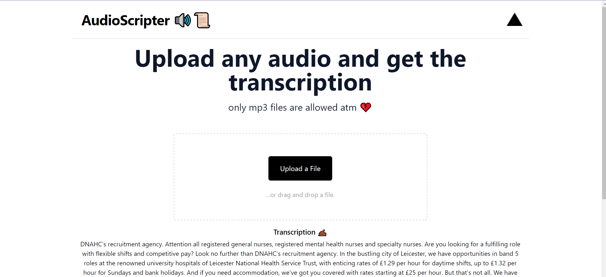

# [AudioScripter 🔊📜]

This project uses AI to turn speech to text. 

[](https://restorephotos.io/)

## How it works

It uses an ML model from [Open AI](https://replicate.com/openai/whisper) called [Whisper](https://replicate.com/openai/whisper) on [Replicate](https://replicate.com/) to turn an mp3 to text. This application gives you the ability to upload an audio and get a transcription back.

## Running Locally
 You can git clone from [this](https://github.com/greatsage-raphael/audioScripter).

### Cloning the repository the local machine.

```bash
git clone
```

### Creating a account on Replicate to get an API key.

1. Go to [Replicate](https://replicate.com/) to make an account.
2. Click on your profile picture in the top right corner, and click on "Dashboard".
3. Click on "Account" in the navbar. And, here you can find your API token, copy it.

### Creating a account on ByteScale to get an API key.

1. Go to [ByteScale](https://www.bytescale.com/) to make an account.
2. Get the api key and paste it in .env

### Storing API key in .env file.

Create a file in root directory of project with env. And store your API key in it, as shown in the .example.env file.

If you'd also like to do rate limiting, create an account on UpStash, create a Redis database, and populate the two environment variables in `.env` as well. If you don't want to do rate limiting, you don't need to make any changes.

### Installing the dependencies.

```bash
npm install
```

### Running the application.

Then, run the application in the command line and it will be available at `http://localhost:3000`.

```bash
npm run dev
```

## One-Click Deploy

Deploy the example using [Vercel](https://vercel.com?utm_source=github&utm_medium=readme&utm_campaign=vercel-examples):

[](https://vercel.com/new/clone?repository-url=https://github.com/greatsage-raphael/audioScripter&env=REPLICATE_API_KEY&project-name=AudioScripter&repo-name=audioScripter)

## Powered by

This example is powered by the following services:

- [Replicate](https://replicate.com) (AI API)
- [Bytescale](https://www.bytescale.com/) (storage)
- [Vercel](https://vercel.com) (hosting, serverless functions, analytics)
